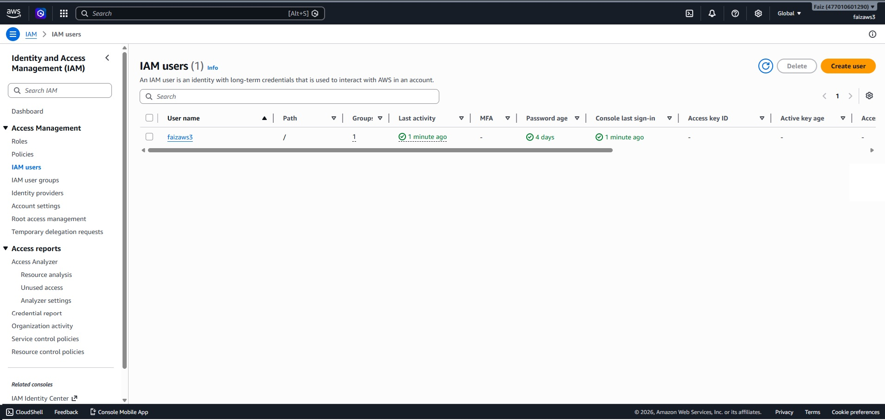
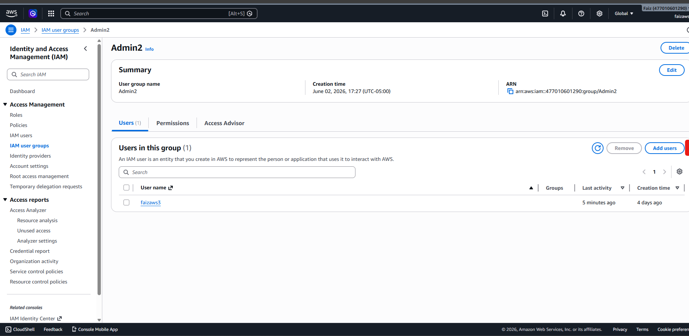
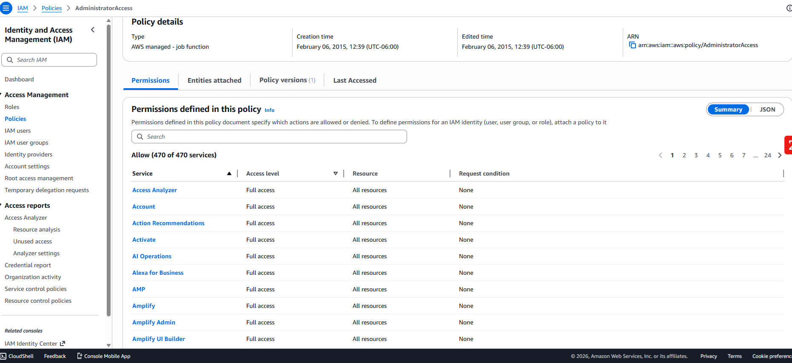

# IAM Security Lab

## Objective

Learn how AWS Identity and Access Management (IAM) controls access to AWS resources.

## AWS Services Used

- AWS IAM

## Tasks Completed

- Created IAM User
- Created IAM Group
- Assigned AdministratorAccess policy
- Logged in using IAM credentials

## Business Value

IAM helps organizations control who can access cloud resources and what actions they can perform.

## Key Concepts Learned

### User
Represents an individual person.

### Group
Collection of users with similar permissions.

### Policy
Defines permissions using JSON.

### Role
Provides temporary permissions.

## Screenshots

To be added.

## Lessons Learned

IAM is the foundation of AWS security and follows the principle of least privilege.

## Screenshots

### IAM User Created

### User Added to Admin Group

### AdministratorAccess Policy Assigned

